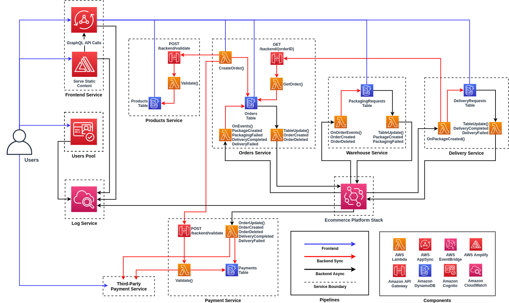

# BigSmokes Ecommerce Platform: Case Study

## Table of Contents
1. [Objective](#objective)
2. [Architecture](#architecture)
    1. [High level architecture](#high-level-architecture)
    2. [Technologies used](#technologies-used)

## Objective:
BigSmokes Cigar is a leader in elite premium cigars that are sold around the globe. Headquartered in Florida, USA, they have been using an on-prem solution for their ecommerce website. This website is their primary source of orders and is backed by microservices. During cyclone Nirma, they discovered how vulnerable their data center is. The data center was wiped out due to the floods and BigSmokes went offline and hence no revenue generated for 2 weeks. This loss is perceived to be a tiny fraction of what BigSmokes will have to spend on Cloud Migration. They have chosen AWS as their cloud partner and are looking for a proposal from Cognizant to migrate their On-prem site to the cloud. The solution must be best-in-class, but at the same time convince the “very cost conservative” CFO who has to approve the finance. The decisive factors of a winning architecture will be

- __Highly Resilient__: Even if the American Continent is engulfed in floods, they expect to be in business. The have factories worldwide, so manufacturing isn’t a problem
- __Highly Available__: 99.9% available. No noticeable outage and hence no lost orders
- __Performance__: especially response to user requests should never go over a second
- __Cost should not be prohibitive__: While they can spend any amounts of money, the CFO is very particular that the solution MUST cost lesser than the On-Prem Solution
- __Value additions__: Innovation that would buy a better bang for the bucks shelled out by BigSmokes.

## Architecture:
### High-level architecture
This is a high-level view of how the different microservices interact with each other. Each service diagram illustrates individual service stack along with endpoints meant to interact with other services.

### Technologies used

__Communication/Messaging__:

* [AWS AppSync](https://aws.amazon.com/appsync/) for interactions between users and the ecommerce platform.
* [Amazon API Gateway](https://aws.amazon.com/api-gateway/) for service-to-service synchronous communication (request/response).
* [Amazon EventBridge](https://aws.amazon.com/eventbridge/) for service-to-service asynchronous communication (emitting and reacting to events).

__Authentication/Authorization__:

* [Amazon Cognito](https://aws.amazon.com/cognito/) for managing and authenticating users, and providing JSON web tokens used by services.
* [AWS Identity and Access Management](https://aws.amazon.com/iam/) for service-to-service authorization, either between microservices (e.g. authorize to call an Amazon API Gateway REST endpoint), or within a microservice (e.g. granting a Lambda function the permission to read from a DynamoDB table).

__Compute__:

* [AWS Lambda](https://aws.amazon.com/lambda/) as serverless compute either behind APIs or to react to asynchronous events.

__Storage__:

* [Amazon DynamoDB](https://aws.amazon.com/dynamodb/) as a scalable NoSQL database for persisting informations.

__Monitoring__:

* [Amazon CloudWatch](https://aws.amazon.com/cloudwatch/) for metrics, dashboards, log aggregation.
### Backend services

|  Services  | Description                               |
|------------|-------------------------------------------|
| [users](frontend.png) | Provides user management, authentication and authorization. |
| [products](products.png) | Source of truth for products information. |
| [orders](orders.png) | Manages order creation and status. |
| [warehouse](warehouse.png) | Manages inventory and packaging orders. |
| [delivery](delivery.png) | Manages shipping and tracking packages. |
| [payment](payment.png) | Manages payment collection and refunds. |

### Frontend service

|  Services  | Description                               |
|------------|-------------------------------------------|
| [frontend-api](frontend.png) | User-facing API for interacting with the services. |

### Infrastructure services

|  Services  | Description                               |
|------------|-------------------------------------------|
| platform | Core platform resources for deploying backend services. |

